# Otter — User Flows & Diagrams

> Complete visual guide to every interaction in the Otter protocol.

---

## 1. Main Flow — End to End

The full journey from connecting a wallet to receiving a confirmed execution with MEV rebate.

```mermaid
flowchart TD
    A[User connects wallet] --> B[Deposits USDC into Vault]
    B --> C[Types intent: "Lend 1000 USDC if yield > 3%"]
    C --> D[LLM parses intent]
    D --> E[User reviews parsed intent]
    E --> F[User sets delegation limits]
    F --> G[User signs delegation with wallet]
    G --> H[Delegation stored on-chain]
    H --> I[Agent monitors conditions]
    I --> J{Yield > 3%?}
    J -->|No| I
    J -->|Yes| K[Agent generates ZKP]
    K --> L[Agent captures MEV]
    L --> M[Agent submits tx to Vault]
    M --> N[Vault verifies ZKP]
    N -->|Valid| O[Vault executes on Aave]
    N -->|Invalid| P[Transaction reverts]
    O --> Q[MEV split: 50% user / 40% agent / 10% protocol]
    Q --> R[User sees confirmation in UI]
    R --> S[Permanent proof recorded on-chain]
```

---

## 2. Flow by Role

### 2.1 User Flow

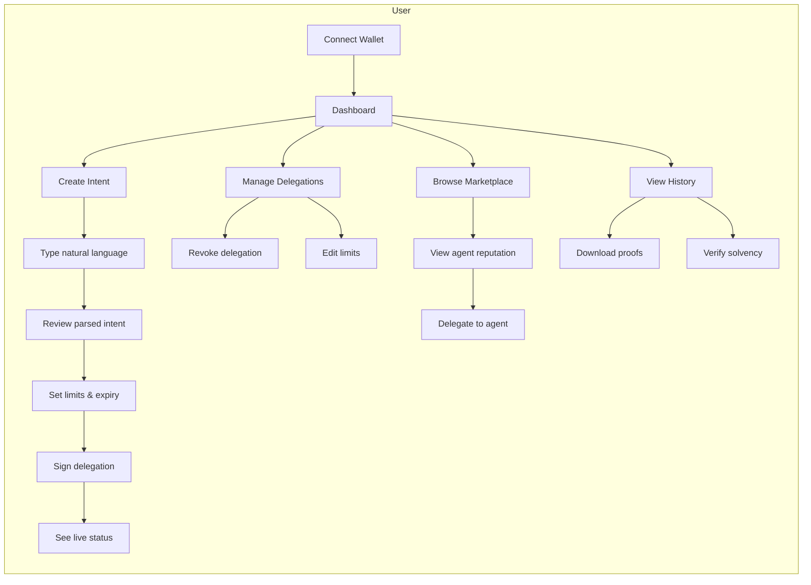

### 2.2 Agent Flow

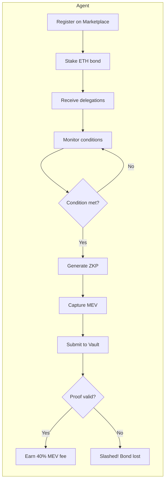

### 2.3 Vault Contract Flow

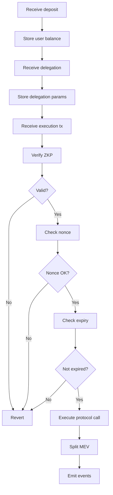

---

## 3. Feature Flows

### 3.1 ZKP Delegation Proof

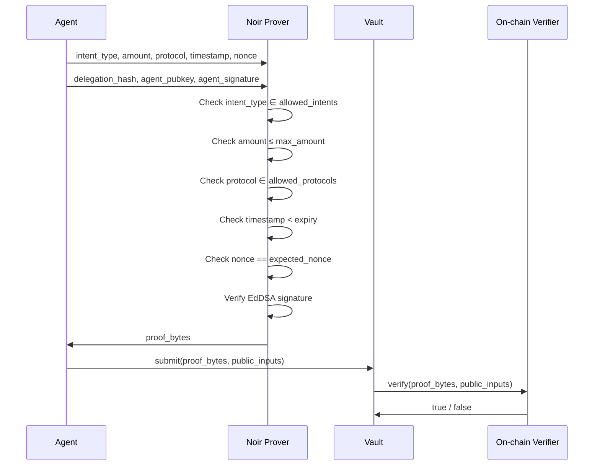

### 3.2 MEV Capture & Rebate

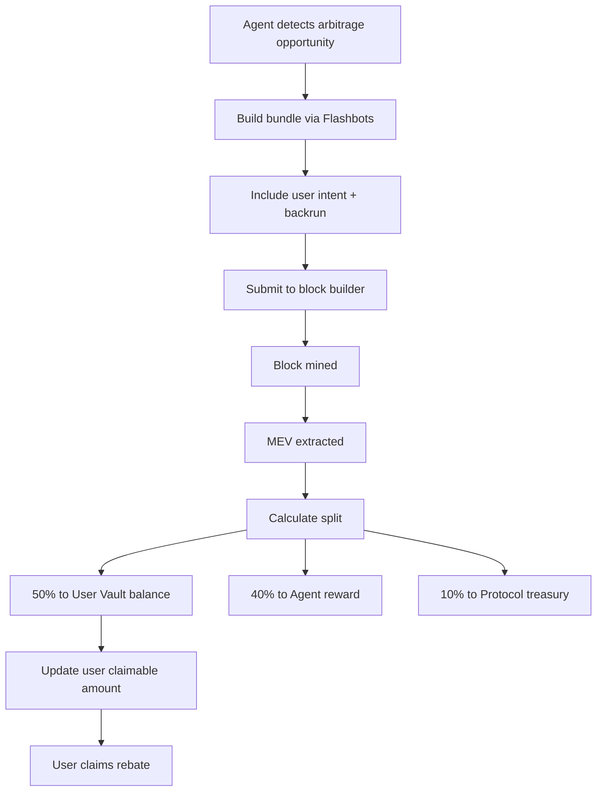

### 3.3 Proof-of-Solvency

```mermaid
flowchart TD
    A[Daily cron triggers] --> B[Read all user deposits]
    B --> C[Read vault asset balances]
    C --> D[Generate ZKP: sum(deposits) ≤ assets]
    D --> E[Publish proof on-chain]
    E --> F[Update UI timestamp]
    F --> G[User verifies independently]
```

### 3.4 Social — Strategy Sharing

```mermaid
flowchart TD
    A[User creates winning strategy] --> B[Click "Publish Strategy"]
    B --> C[Set creator fee: 0.1%]
    C --> D[Mint Strategy NFT]
    D --> E[Strategy appears on Marketplace]
    E --> F[Other users see it]
    F --> G[User clicks "Copy Strategy"]
    G --> H[Auto-fill delegation params]
    H --> I[User signs new delegation]
    I --> J[Creator earns fee on every copy execution]
```

### 3.5 Agent Marketplace

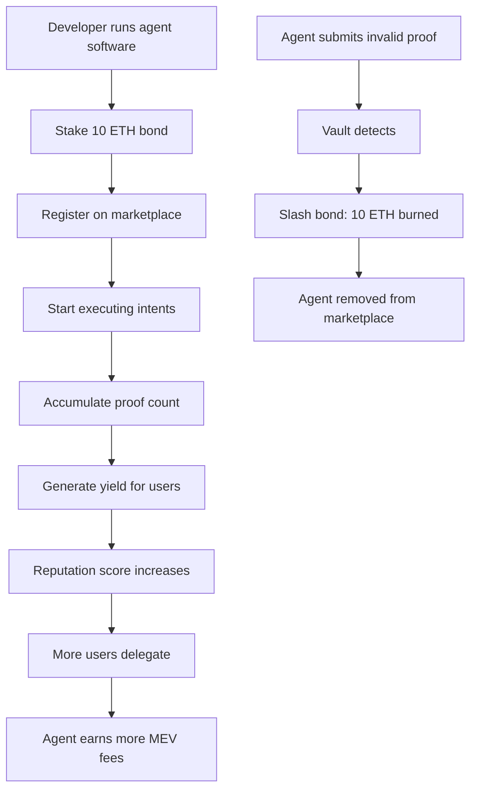

---

## 4. Error & Edge Case Flows

### 4.1 Invalid Proof

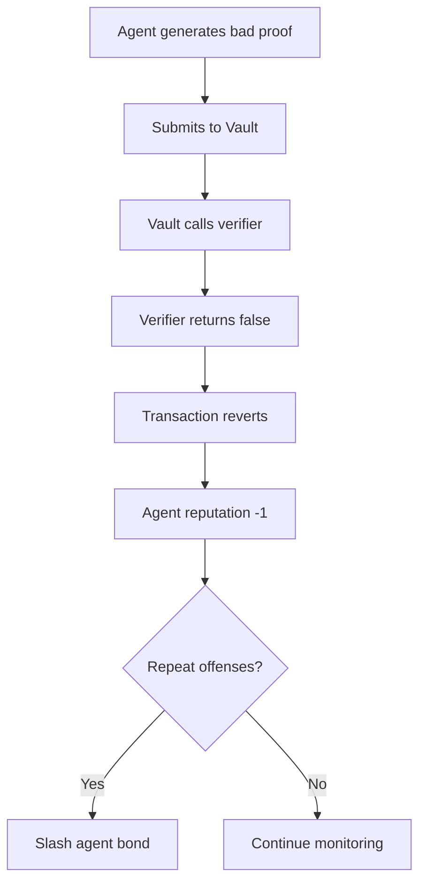

### 4.2 Delegation Expired

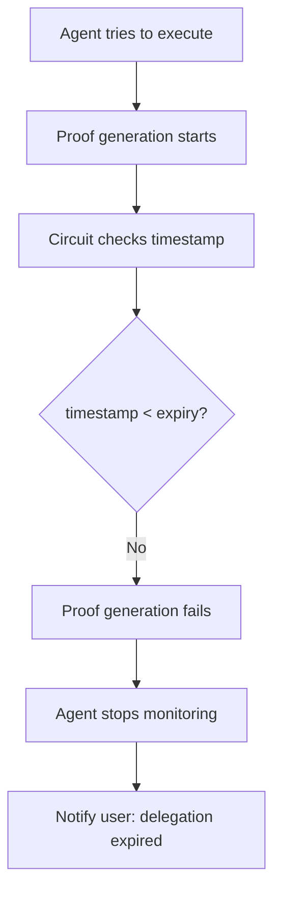

### 4.3 Revoke Delegation

```mermaid
flowchart TD
    A[User clicks "Revoke"] --> B[Sign revoke transaction]
    B --> C[Vault increments nonce]
    C --> D[Old delegation invalidated]
    D --> E[Agent's next proof fails nonce check]
    E --> F[Agent stops executing for this user]
```

### 4.4 Server Downtime (Liveness Failure)

```mermaid
flowchart TD
    A[Agent server goes offline] --> B[Conditions not monitored]
    B --> C[Intent never executes]
    C --> D[User sees "Agent offline" status]
    D --> E{Agent offline > 24h?}
    E -->|Yes| F[User revokes delegation]
    E -->|No| G[Wait for agent recovery]
```

---

## 5. Data Flow

### 5.1 Intent → Proof → Execution

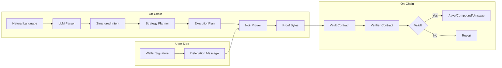

### 5.2 State Transitions

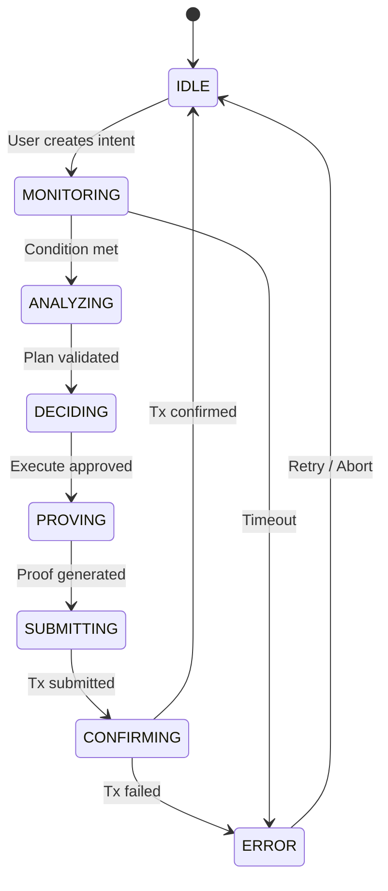

---

## 6. Multi-Chain Flow

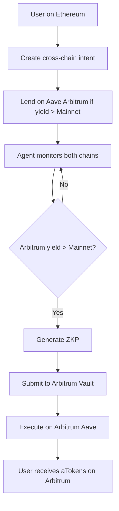

---

## 7. Quick Reference — All Flows

| Flow | Trigger | Actor | Output |
|------|---------|-------|--------|
| **Intent Creation** | User types text | User | Parsed intent + delegation |
| **Condition Monitoring** | Every 60s | Agent | ConditionMet event |
| **ZKP Generation** | Condition met | Agent | proof_bytes |
| **MEV Capture** | During execution | Agent | Extracted value |
| **Vault Execution** | ZKP verified | Vault | Protocol tx + events |
| **MEV Rebate** | Post-execution | Vault | User claimable amount |
| **Solvency Proof** | Daily cron | Vault | On-chain attestation |
| **Strategy Publish** | User clicks | User | Strategy NFT |
| **Copy Strategy** | User clicks | User | New delegation |
| **Agent Register** | Developer stakes | Agent | Marketplace listing |
| **Agent Slash** | Invalid proof | Vault | Bond burned |
| **Revoke** | User signs | User | Nonce incremented |

---

*See [`PRODUCT.md`](PRODUCT.md) for detailed product specification and [`BACKLOG.md`](BACKLOG.md) for implementation stories.*
